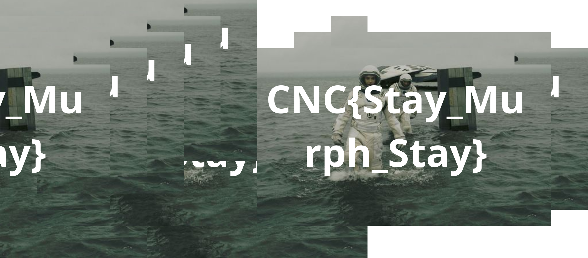

# Recto Verso

I made this small python code after a CTF (Capture the flag) event, the cyber ninja CTF by Oteria. We had to find the flag written on the image but the image was splitted in small rectangles and shuffled.

## Example

The **example_corrected.png** is the example output file with the example.png, dimension_x = 8 and dimension_y = 12 as input.

## How to use it

the library PIL is required ! 
Run the src/main.py file

The output file will be at the same place with "_corrected" before the extension.
